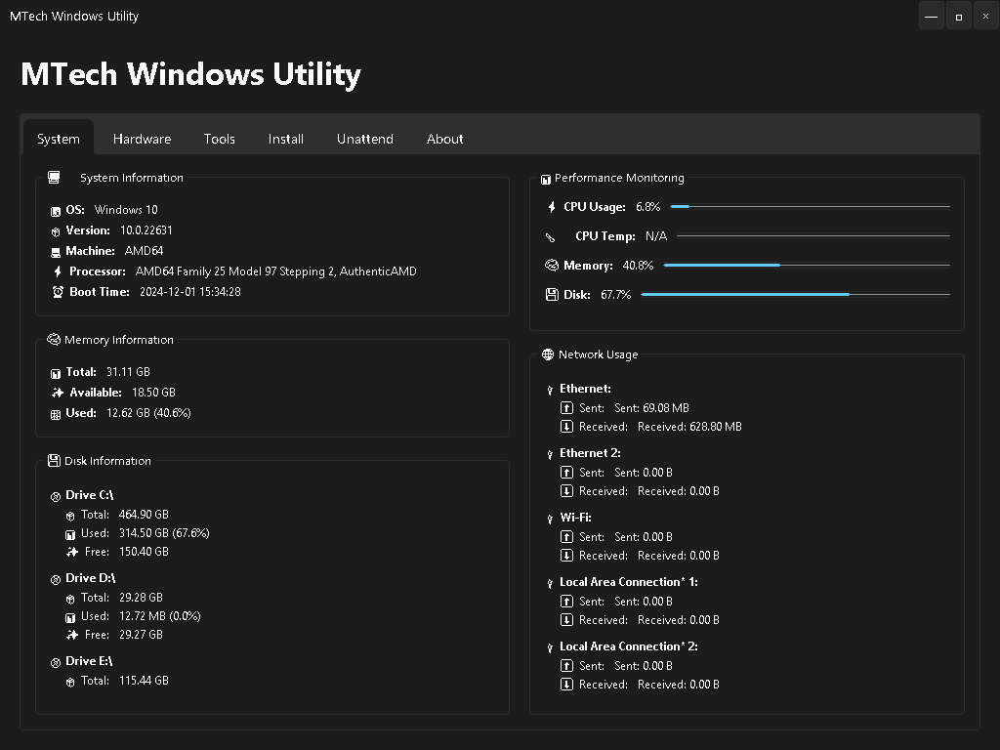
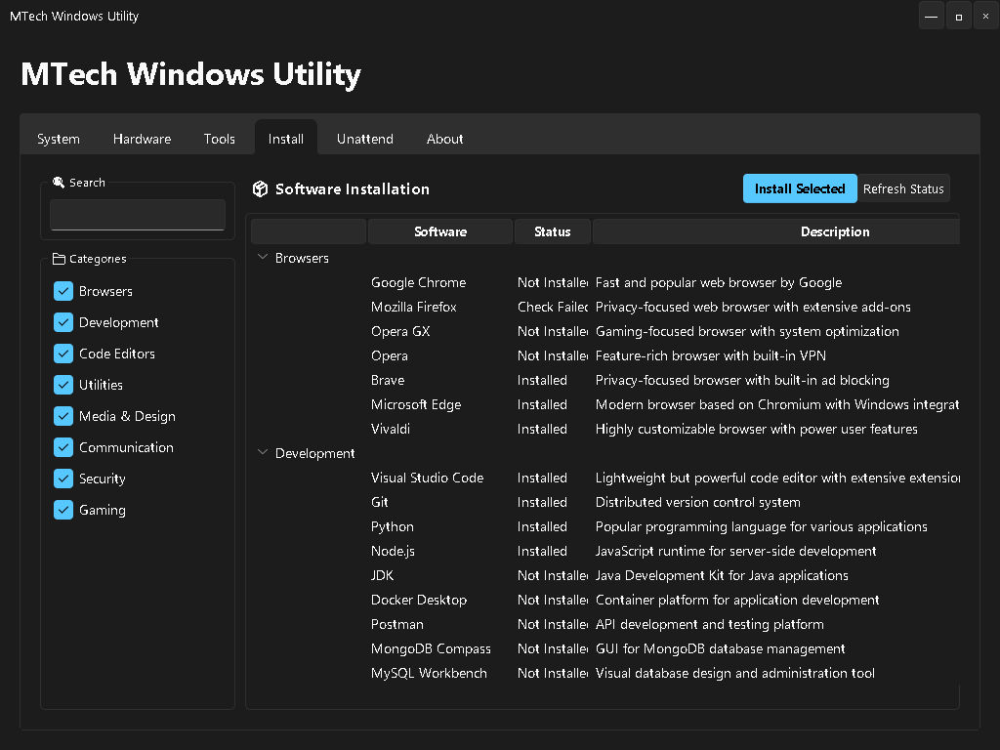
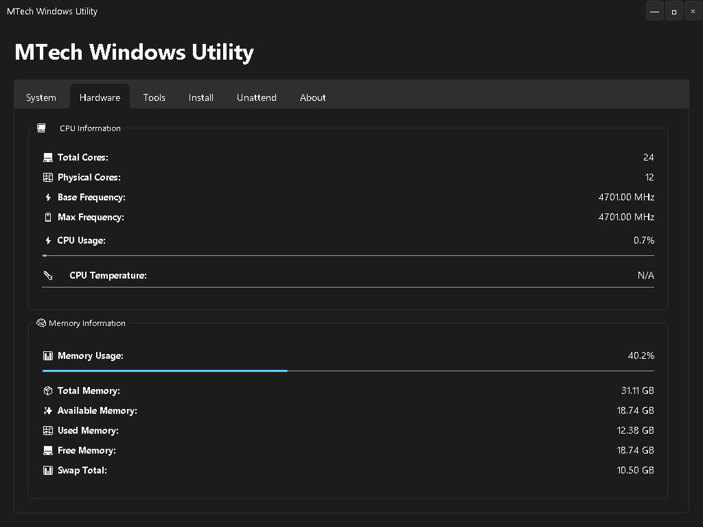
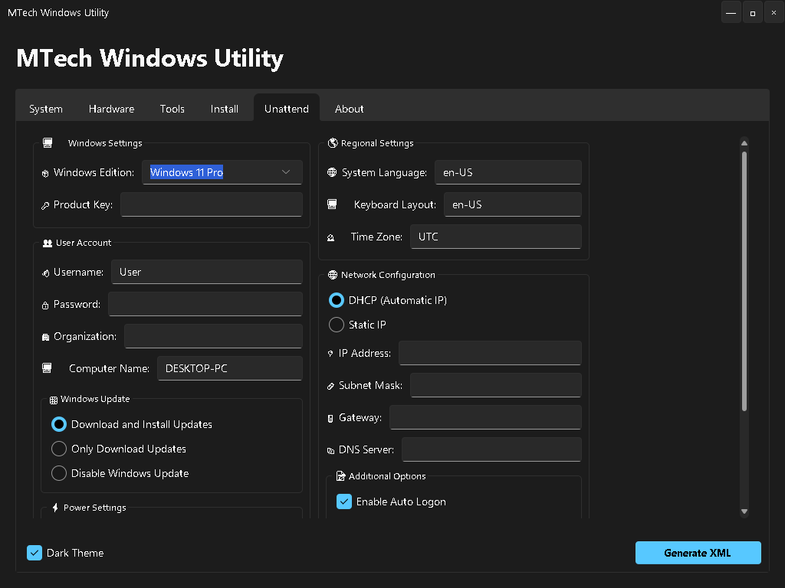

<div align="center">
# MTech WinTool (Beta 0.0.3a)

⚡ **Supercharge Your Windows Experience!**

**A powerful Windows utility that puts you in control. Monitor your system, manage software, and optimize performance - all with a beautiful, modern interface.**

Crafted with Python and Tkinter, featuring the stunning Sun Valley theme for a native Windows 11 look.

</div>

## 🚀 Quick Start

### One-Click Install (PowerShell)

```powershell
Invoke-WebRequest -Uri https://github.com/MTechWare/wintools/releases/download/v0.0.3a/MTechWinTool.exe -OutFile MTechWinTool.exe; Start-Process .\MTechWinTool.exe
```

### Manual Download

Download the latest release from [GitHub Releases](https://github.com/MTechWare/wintools/releases) and run the executable.

## 🔧 Requirements

- Windows 10/11
- Python 3.11+ (for building from source)
- Winget package manager
- Administrator privileges (for some features)

## 💡 Pro Tips
- right-click uninstallation of a package
- Use system tray to keep the tool running in background
- Use category filters to find software quickly
- Keep the tool updated for best performance

## ✨ Features

### 🛠️ Winget Feature
- Automatic winget installation if not present
- Smart package detection shows already installed software
- Real-time status tracking of installed packages
- Batch processing for faster package checks
- Silent installation support
- Seamless integration with Windows Package Manager

### 💻 System Management
- Real-time CPU, Memory, and Disk monitoring
- Detailed hardware information
- System optimization tools
- Windows unattended installation configuration

### 📦 Software Management
- One-click software installation via winget
- Pre-configured software categories
  - Browsers (Chrome, Firefox, Opera)
  - Development Tools (VS Code, Git, Python)
  - Code Editors (IntelliJ, PyCharm, Sublime)
  - Utilities (7-Zip, VLC, Notepad++)

### 🎨 Modern UI
- Sleek Sun Valley theme
- Dark mode
- System tray integration
- Real-time status updates

## 📸 Screenshots

<div align="center">

| System Monitoring | Software Installation |
|:---:|:---:|
|  |  |
| *Real-time system monitoring* | *Easy software installation* |

| Hardware Information | Windows Configuration |
|:---:|:---:|
|  |  |
| *Hardware monitoring* | *Windows configuration* |

</div>

## 🆕 What's New in Beta 0.0.3a

### ✨ New Features
- Added Settings tab for better customization
- Enhanced minimize to tray with first-time notification
- Improved settings persistence

### 🔧 Improvements
- Major optimization in software status checking
- Silent mode for software operations
- Better timeout handling
- Smaller executable size when building from source

### 🐛 Bug Fixes
- Fixed software status refresh performance
- Enhanced thread safety in UI updates
- Improved error handling

## 🛠️ Building from Source

1. Clone the repository
   ```bash
   git clone https://github.com/MTechWare/wintools.git
   ```

2. Install dependencies
   ```bash
   install.cmd
   ```

3. Build executable
   ```bash
   Build.cmd
   ```

## 📝 License

This project is licensed under the MIT License - see the LICENSE file for details.

## 🤝 Contributing

Feel free to:
- Report issues
- Suggest features
- Submit pull requests

## 📫 Contact

- GitHub Issues: [Report a bug](https://github.com/MTechWare/wintools/issues)

---

<div align="center">

Made with ❤️ by MTechWare

</div>
